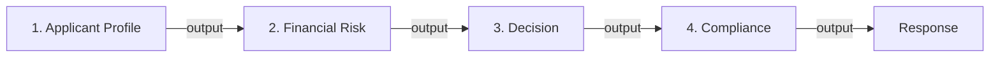

# 🏗️ System Architecture Documentation

## Design Principles

1. **Separation of Concerns**: Each agent has a single, well-defined responsibility
2. **Loose Coupling**: Agents communicate through standard interfaces (MCP)
3. **Scalability**: Asynchronous processing and modular design enable scaling
4. **Explainability**: All decisions include reasoning and audit trails
5. **Reliability**: Error handling, validation, and retry logic throughout

## Microservices Architecture

```
┌─────────────────────────────────────────────────────────────┐
│                   User Layer                                │
│                  (Streamlit UI)                             │
└────────────────────────┬────────────────────────────────────┘
                         │ HTTP/JSON
┌────────────────────────▼────────────────────────────────────┐
│              API Gateway (FastAPI)                          │
│  - Request routing                                          │
│  - Request validation                                       │
│  - Response formatting                                      │
│  - Error handling                                           │
└────────────────────────┬────────────────────────────────────┘
                         │ Python
┌────────────────────────▼────────────────────────────────────┐
│           Orchestration Layer (LangGraph)                   │
│  - Workflow DAG definition                                  │
│  - State management                                         │
│  - Agent coordination                                       │
│  - Error recovery                                           │
└────────────────────────┬────────────────────────────────────┘
                         │ Async
┌─────────┬──────────┬──────────┬─────────────────────────────┐
│         │          │          │                             │
▼         ▼          ▼          ▼                             ▼
Agent1  Agent2    Agent3     Agent4                      Error
 |       |         |          |                          Handler
 └───────┼─────────┼──────────┴──────────────────────────┘
         │
    ┌────▼─────────────────────────────────────────────┐
    │         MCP Server Layer                         │
    │  - Standardized tool interfaces                  │
    │  - Data encapsulation                            │
    │  - Tool availability declaration                 │
    └─────────────────────────────────────────────────┘
         │
    ┌────▼─────────────────────────────────────────────┐
    │     Data Layer                                   │
    │  - Business rules                                │
    │  - Decision algorithms                           │
    │  - Compliance rules                              │
    └─────────────────────────────────────────────────┘
```

## Data Flow

### Request Flow
```
1. User submits application via Streamlit
   ↓
2. Streamlit makes HTTP POST to FastAPI (/api/loan-application)
   ↓
3. FastAPI validates request using Pydantic models
   ↓
4. FastAPI passes to LoanApprovalOrchestrator.process_application()
   ↓
5. Orchestrator initializes state dict with application
   ↓
6. Orchestrator invokes agents sequentially
   ↓
7. Each agent processes state and returns updated state
   ↓
8. Final state contains all results
   ↓
9. FastAPI formats response using LoanDecisionResponse model
   ↓
10. Response returned to Streamlit and displayed to user
```

### State Propagation
```
State Dict:
{
  "application": LoanApplication,
  "applicant_profile": ApplicantProfileOutput,  # Added by Agent 1
  "financial_risk": FinancialRiskOutput,        # Added by Agent 2
  "decision": LoanDecisionOutput,               # Added by Agent 3
  "compliance": ComplianceAction,               # Added by Agent 4
  "audit_trail": [...]                          # Updated throughout
}
```

## Agent Architecture

### Agent Interface
Each agent implements this async interface:

```python
class Agent:
    async def process(self, input_data: Dict) -> Dict:
        # 1. Validate input
        # 2. Call MCP server(s)
        # 3. Process results
        # 4. Return output
        pass
```

### Agent Communication
Agents communicate **only through**:
1. Orchestrator's state dictionary
2. MCP server calls for external data

They do **not** call each other directly.

### Agent Execution Order



Sequential execution ensures:
- Later agents have complete prior data
- Easy debugging (clear dependencies)
- Deterministic results
- Easy error handling

## MCP Server Pattern

Each MCP server follows this pattern:

```python
def create_xxx_server():
    server = Server("XxxServer")
    
    @server.call_tool()
    async def tool_function(params: Dict) -> Dict:
        # Implement business logic
        return result
    
    return server
```

### Tool Registry
Each server exposes tools that agents call:

| Server | Tools | Used By |
|--------|-------|---------|
| ApplicantDB | `analyze_applicant_profile`, `get_credit_history`, `verify_employment` | Applicant Agent |
| RiskRulesDB | `analyze_financial_risk`, `calculate_dti_ratio`, `check_business_rules` | Financial Risk Agent |
| DecisionSynthesis | `synthesize_decision`, `evaluate_approval_probability` | Decision Agent |
| NotificationSystem | `send_notification`, `log_audit`, `create_case_file` | Compliance Agent |

## Error Handling Strategy

### Multi-Layer Validation
```
1. FastAPI Input Validation (Pydantic)
   ↓
2. Orchestrator Validation
   ↓
3. Agent Input Validation
   ↓
4. MCP Server Response Validation
   ↓
5. Output Model Validation (Pydantic)
```

### Error Recovery
```
┌─────────────────┐
│ Try Processing  │
└────────┬────────┘
         │
         ├─→ Success → Return Result
         │
         └─→ Failure → Check Retry Count
                        ├─→ Retries Left → Retry
                        └─→ No Retries → Log Error & Return
```

## State Management

### Session State (Streamlit)
```python
st.session_state.counter      # Application counter
st.session_state.last_result  # Last decision
st.session_state.history      # Application history
```

### Orchestrator State
```python
self.audit_trail = []         # Processing trail
self.agent_results = {}       # Agent outputs
```

### Request State (Per-Request)
```python
state = {
    "application": {...},
    "applicant_profile": {...},
    "financial_risk": {...},
    "decision": {...},
    "compliance": {...}
}
```

## Configuration Management

### Layered Configuration
```
┌──────────────────────────────────────┐
│  Default settings.py                 │
│  (hardcoded defaults)                │
└────────────────┬─────────────────────┘
                 │
┌────────────────▼─────────────────────┐
│  .env file                           │
│  (environment variables)             │
└────────────────┬─────────────────────┘
                 │
┌────────────────▼─────────────────────┐
│  settings object                     │
│  (runtime values)                    │
└──────────────────────────────────────┘
```

Decision thresholds can be modified without code changes:
```env
CREDIT_SCORE_THRESHOLD=600
DTI_RATIO_THRESHOLD=0.43
INCOME_STABILITY_MIN=0.7
```

## Workflow as Graph

### Orchestrator Implementation
The orchestrator is **not** a true LangGraph implementation but follows graph principles:

```python
# Conceptual graph representation
workflow = {
    "nodes": {
        "applicant_agent": ApplicantProfileAgent(),
        "financial_risk_agent": FinancialRiskAgent(),
        "decision_agent": LoanDecisionAgent(),
        "compliance_agent": ComplianceAgent()
    },
    "edges": [
        ("start", "applicant_agent"),
        ("applicant_agent", "financial_risk_agent"),
        ("financial_risk_agent", "decision_agent"),
        ("decision_agent", "compliance_agent"),
        ("compliance_agent", "end")
    ]
}
```

### Sequential Execution
```python
async def process_application(self, application):
    state = {"application": application, "audit_trail": []}
    
    state = await self.applicant_agent.analyze(application)
    state = await self.financial_risk_agent.analyze(state)
    state = await self.decision_agent.decide(state)
    state = await self.compliance_agent.process(state)
    
    return state
```

## API Contract

### Request Schema
```json
{
  "applicant_id": "string",
  "age": "integer (18-80)",
  "income": "float (> 0)",
  "employment_type": "string (enum)",
  "credit_score": "integer (300-850)",
  "loan_amount": "float (> 0)",
  "tenure_months": "integer (6-360)",
  "existing_liabilities": "float (>= 0)",
  "location": "string"
}
```

### Response Schema
```json
{
  "applicant_id": "string",
  "decision": {
    "classification": "approved|rejected|review",
    "risk_score": "float (0-1)",
    "confidence_level": "float (0-1)",
    "key_decision_factors": {
      "primary_factors": ["string"],
      "secondary_factors": ["string"],
      "risk_mitigation": "string|null"
    },
    "explanation": "string"
  },
  "applicant_profile": {...},
  "financial_risk": {...},
  "compliance": {
    "action_taken": "string",
    "case_id": "string",
    "notification_sent": "boolean"
  },
  "processing_time_seconds": "float",
  "audit_trail": ["string"]
}
```

## Logging Strategy

### Log Levels
- **DEBUG**: Detailed agent processing, internal state
- **INFO**: Agent decisions, workflow progress
- **WARNING**: Retries, anomalies detected
- **ERROR**: Processing failures, exceptions

### Log Output
```
TIMESTAMP - LOGGER_NAME - LEVEL - MESSAGE

2024-01-15 10:30:45,123 - agents.orchestrator - INFO - Starting loan approval workflow for APP-001
2024-01-15 10:30:45,234 - agents.applicant_agent - INFO - Analyzing applicant profile for APP-001
2024-01-15 10:30:45,345 - agents.financial_risk_agent - INFO - Analyzing financial risk for APP-001
```

## Security Considerations

### Input Validation
- All inputs validated against Pydantic models
- Type checking and range validation
- SQL injection prevention (no SQL used)
- XSS prevention (API responses are JSON)

### Output Sanitization
- Sensitive data not exposed in error messages
- Audit trail doesn't contain credentials
- Case IDs are UUIDs (not sequential)

### Secrets Management
- API keys in environment variables only
- No secrets in code or logs
- .env excluded from version control

## Performance Optimization

### Caching Opportunities
- Credit history lookups (if calling real database)
- Employment verification
- Business rule cache

### Async/Await
- Non-blocking I/O for MCP calls
- Parallel agent execution possible (future enhancement)
- Background processing for notifications

### Monitoring Points
```python
start_time = datetime.now()
# ... processing ...
elapsed = (datetime.now() - start_time).total_seconds()
```

## Future Enhancements

### Phase 2: Parallel Agents
```python
applicant_task = asyncio.create_task(applicant_agent.analyze(...))
financial_task = asyncio.create_task(financial_risk_agent.analyze(...))

applicant_profile = await applicant_task
financial_risk = await financial_task
```

### Phase 3: Real LangGraph Integration
```python
from langgraph.graph import StateGraph

workflow = StateGraph(ApplicationState)
workflow.add_node("applicant", applicant_node)
workflow.add_node("financial", financial_node)
workflow.add_edge("applicant", "financial")
```

### Phase 4: Database Integration
- Store applications in PostgreSQL
- Cache decisions
- Historical analytics
- Decision audit table

### Phase 5: ML Integration
- Train model on historical decisions
- Confidence scoring with historical accuracy
- Pattern detection
- Fraud scoring

## Deployment Considerations

### Docker Containerization
```dockerfile
FROM python:3.11-slim
WORKDIR /app
COPY requirements.txt .
RUN pip install -r requirements.txt
COPY . .
CMD ["python", "-m", "backend.main"]
```

### Kubernetes Ready
- Stateless design (no session persistence)
- Health checks available
- Configurable via environment
- Graceful shutdown handling

### Monitoring/Observability
- Prometheus metrics available
- Structured logging for log aggregation
- Distributed tracing ready
- Performance metrics in response

---

For implementation details, see individual module docstrings.
